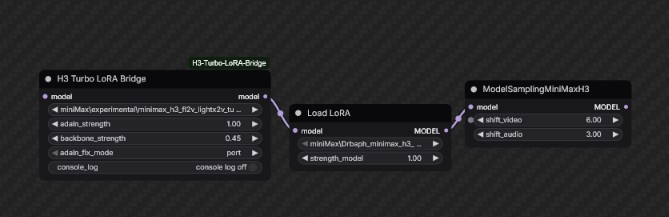

# H3 Turbo LoRA Bridge

Custom LoRA loader to run these loras [https://huggingface.co/silveroxides/MiniMax-H3_tests/tree/main](https://huggingface.co/silveroxides/MiniMax-H3_tests/tree/main/experimental)

# Important 

Create folder: h3_adaln in "ComfyUI/models" folder

https://huggingface.co/deAPI-ai/minimax-h3-33b-int8/resolve/main/loras/h3_silu_temb_grid.safetensors put this file in h3_adaln folder

# Settings


Backbone 0.25-0.45 .  It works as pseudo "model_strength". 

Default 0.45 is considered high IMO, but it's also safe-ish, as in it's less likely to introduce "artifact".
Recommend setting: 
                  
                   FL2V : 0.25-0.4
                  
                   Ref2V : 0.35-0.45




Sampler Euler - Simple/Beta  (haven't tested others/ beta57 seems ok)
Steps 4-8
## Recommended graph

```text
UNETLoader
  -> H3 Turbo LoRA Bridge
  -> Comfy Load Lora (if any)
  -> MiniMaxH3SigmaShift
  -> sampler
```
Put it in front of other lora loaders to be safe.
Do **not** use this loader to load normal loras

## Installation

Copy or clone this repository into:

```text
ComfyUI/custom_nodes/ComfyUI-H3-Turbo-LoRA-Bridge
```

## Attribution and licenses

This project contains/adapts code from two upstream projects:

1. [Larryvrh/ComfyUI-MiniMax-H3-Turbo](https://github.com/Larryvrh/ComfyUI-MiniMax-H3-Turbo) — Apache License 2.0. The repository root `LICENSE` contains the Apache-2.0 text used for this project.
2. [PlagueKind/ComfyUI-PlagueKind-Nodes](https://github.com/PlagueKind/ComfyUI-PlagueKind-Nodes), specifically the H3 AdaLN LoRA Fix core — MIT License. The vendored source and its MIT license are in `plaguekind_h3_adaln/`.

